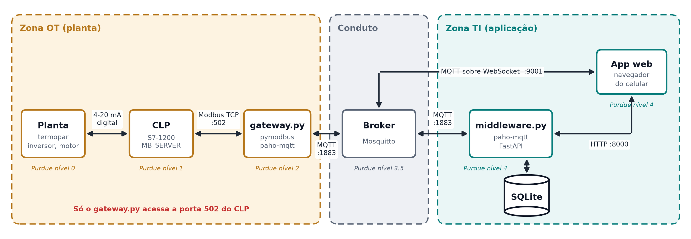
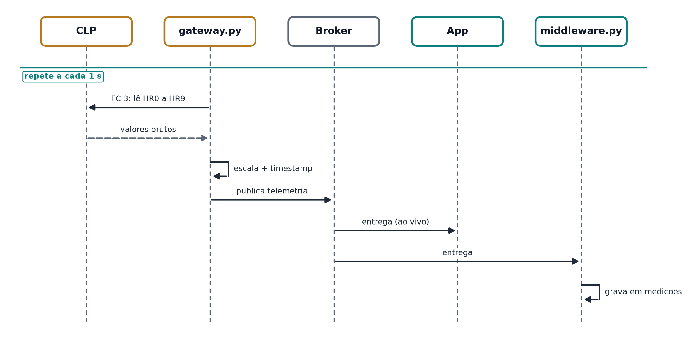
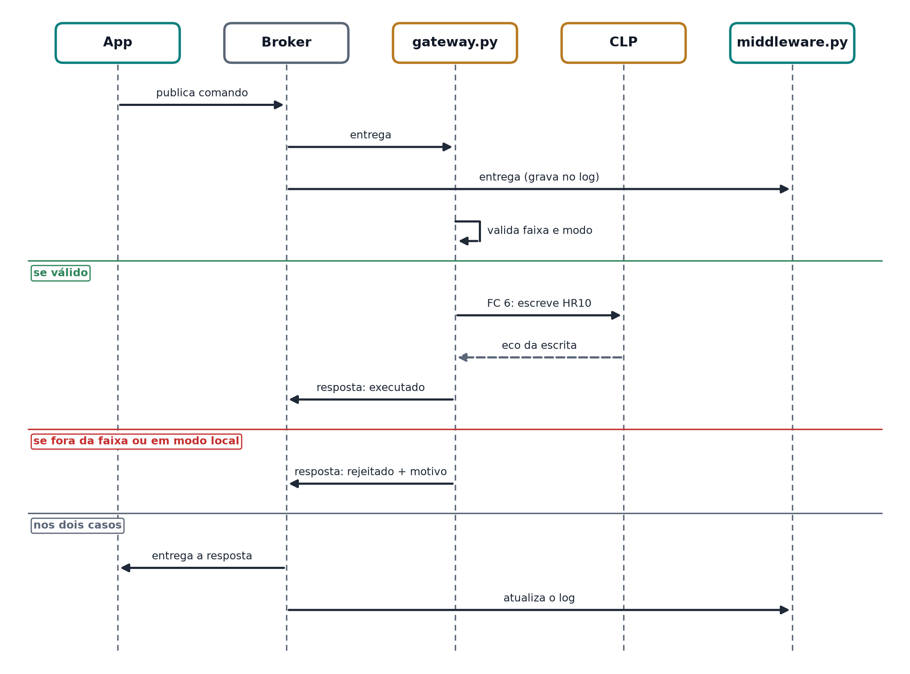
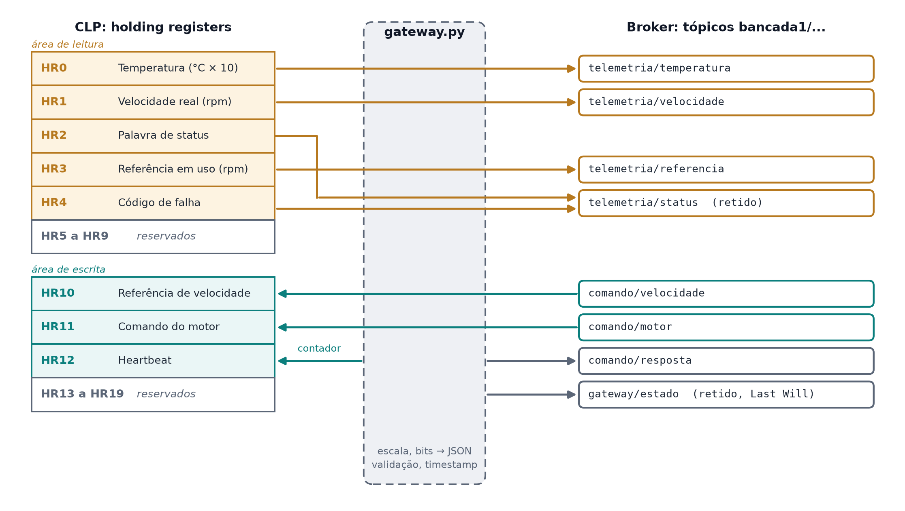
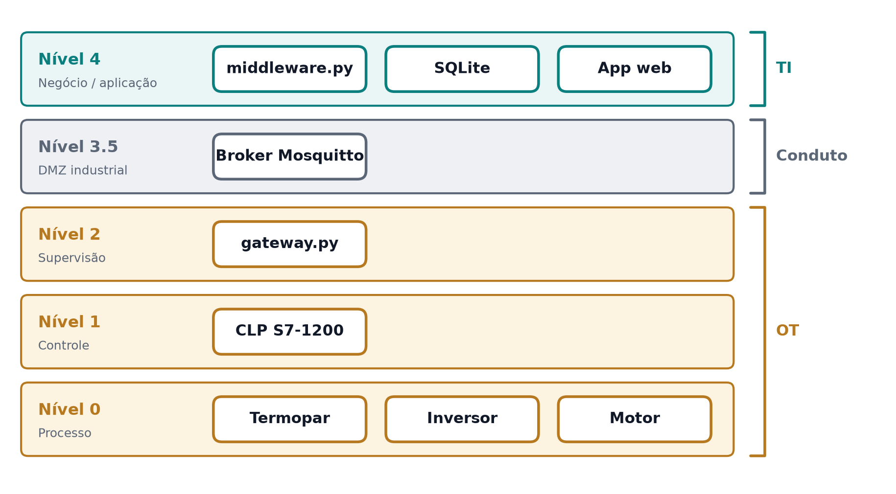
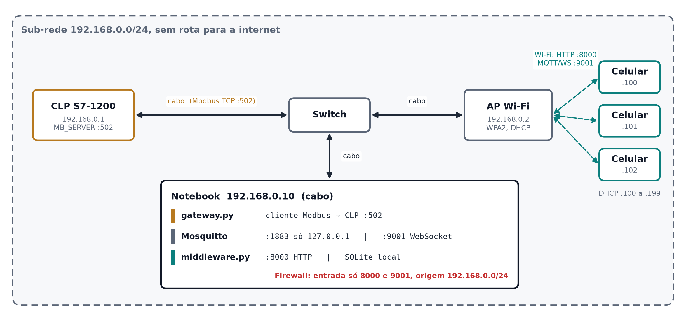

# Arquitetura do Projeto: Planta Industrial Monitorada e Comandada pelo Celular

Monitoria de Introdução às Redes de Comunicação, UFPE

## 1. Objetivo

Monitorar e comandar uma planta real (CLP S7-1200, termopar, inversor de frequência e motor) a partir de um celular, passando por um gateway Modbus/MQTT, um broker MQTT, um middleware com banco de dados e um app web.

O projeto continua as aulas anteriores:

- **Aula 1:** cliente Modbus TCP em JavaScript, sem hardware.
- **Aula 2:** CLP configurado como servidor Modbus TCP (`MB_SERVER`) e o modelo Purdue com zonas e condutos.
- **Este projeto:** o cliente Modbus vira um gateway em Python, e a planta passa a ser acessada por uma arquitetura em camadas que respeita zonas e condutos.

## 2. Visão geral

As figuras deste documento são geradas pelo script `figuras.py` (matplotlib). Para alterar uma figura, edite o script e rode `python figuras.py`.



Regra central: **só o `gateway.py` fala com o CLP.** Nenhum outro componente acessa a porta 502.

## 3. Camadas e tecnologias

| Camada | Responsabilidade | Tecnologia |
|---|---|---|
| Planta | Medir temperatura, girar o motor | Termopar, inversor de frequência (referência 4-20 mA), motor |
| CLP | Ler sensores, acionar inversor, aplicar intertravamentos, expor dados em registradores | Siemens S7-1200, `MB_SERVER` (Modbus TCP, porta 502) |
| Gateway | Traduzir Modbus para MQTT nos dois sentidos, validar comandos, enviar heartbeat | Python 3, **pymodbus** (cliente Modbus TCP), **paho-mqtt** |
| Broker | Entregar mensagens entre gateway, middleware e app, com autenticação e ACL | **Mosquitto** |
| Middleware | Gravar telemetria e comandos no banco, servir o app e o histórico por HTTP | Python 3, **paho-mqtt**, **sqlite3** (biblioteca padrão), **FastAPI** + **uvicorn** |
| Banco | Histórico de medições e log de comandos | **SQLite** |
| App | Mostrar dados ao vivo e histórico, enviar comandos | HTML + JavaScript, **MQTT.js** (MQTT sobre WebSocket) |

### Protocolo em cada ligação

| Ligação | Protocolo | Porta |
|---|---|---|
| Sensores e inversor ⇄ CLP | Sinais elétricos (analógico 4-20 mA, digital) | |
| CLP ⇄ gateway | Modbus TCP | 502 |
| Gateway ⇄ broker | MQTT | 1883 |
| Middleware ⇄ broker | MQTT | 1883 |
| App ⇄ broker | MQTT sobre WebSocket | 9001 |
| App ⇄ middleware | HTTP | 8000 |
| Middleware ⇄ banco | SQL (arquivo local) | |

## 4. Fluxos

### 4.1 Telemetria (subida)



### 4.2 Comando (descida)



### 4.3 Histórico

O app pede `GET /historico?grandeza=temperatura&horas=2` ao middleware, que consulta o SQLite e devolve JSON para o gráfico.

## 5. Contrato de dados

Este contrato é o único ponto em que todas as camadas precisam concordar: o programa do CLP, o `gateway.py`, o `middleware.py` e o app. Qualquer mudança aqui precisa ser feita nas quatro pontas ao mesmo tempo.



### 5.1 Regras gerais

| Regra | Definição |
|---|---|
| Tabela Modbus usada | Somente holding registers (FC 3 para ler, FC 6 e FC 16 para escrever) |
| Endereçamento | Base 0, como vai no quadro Modbus. HR0 corresponde ao que alguns softwares chamam de 40001 |
| Tamanho | O DB do `MB_SERVER` é o mesmo da Aula 2, `Array[0..99] of Word`. O contrato usa HR0 a HR19; HR20 a HR99 ficam reservados e são ignorados pelo CLP ([ADR-004](decisoes/ADR-004-papeis-modbus-e-db.md)) |
| Área de leitura | HR0 a HR9: o CLP escreve, o gateway só lê. Lida inteira numa única requisição FC 3 (10 registradores) |
| Área de escrita | HR10 a HR19: o gateway escreve, o CLP só lê e valida |
| Números com casa decimal | Inteiro multiplicado por 10 (235 = 23,5). Sem ponto flutuante, que ocuparia 2 registradores e exigiria combinar a ordem dos bytes |
| Quem aplica a escala | O gateway divide por 10 antes de publicar. O app e o banco só veem valores em unidade de engenharia |

Separar leitura e escrita em faixas diferentes evita que um erro de endereço no gateway sobrescreva uma medição, e permite que o CLP ignore qualquer escrita abaixo de HR10.

### 5.2 Área de leitura (CLP → gateway)

| Registrador | Grandeza | Tipo | Escala e unidade | Faixa | Origem no CLP |
|---|---|---|---|---|---|
| HR0 | Temperatura | Int (com sinal) | ÷ 10, °C | a definir pelo módulo do termopar | Entrada do termopar, já convertida em °C × 10 |
| HR1 | Velocidade real | UInt | rpm | 0 a `VEL_MAX` | Realimentação do inversor (ver observação) |
| HR2 | Palavra de status | Word (bits) | ver 5.4 | | Lógica do CLP |
| HR3 | Referência em uso | UInt | rpm | 0 a `VEL_MAX` | Valor que o CLP está realmente aplicando no inversor, depois dos limites |
| HR4 | Código de falha | UInt | ver 5.5 | 0 a 5 | Lógica do CLP |
| HR5 a HR9 | Reservados | | | | Sempre 0 |

Observação sobre o HR1: a velocidade real só existe se o inversor tiver uma saída analógica ligada numa entrada do CLP. Se não tiver, o CLP copia o HR3 (a referência aplicada) para o HR1 e o app precisa indicar que o valor é estimado.

A diferença entre HR3 e HR10 é proposital. HR10 é o que foi pedido e HR3 é o que o CLP aceitou. Se alguém pedir acima do limite, o app mostra as duas coisas e o aluno vê o intertravamento funcionando.

### 5.3 Área de escrita (gateway → CLP)

| Registrador | Grandeza | Tipo | Valores | Quem valida |
|---|---|---|---|---|
| HR10 | Referência de velocidade | UInt | 0 a `VEL_MAX` rpm | Gateway (rejeita fora da faixa) e CLP (limita de novo) |
| HR11 | Comando do motor | UInt | 0 = parar, 1 = ligar, 2 = reconhecer falha | Gateway (rejeita outros valores) e CLP (só liga em modo remoto, sem falha e com heartbeat) |
| HR12 | Heartbeat | UInt | contador de 0 a 65535, volta a 0 | CLP: se não mudar por 3 s, para o motor e liga o bit 3 do status |
| HR13 a HR19 | Reservados | | | CLP ignora |

HR11 funciona como estado pedido do motor. É a única exceção à regra de que o CLP só lê a área de escrita: depois de executar o reconhecer (2), e sempre que para o motor por falha, modo local ou falta de heartbeat, o CLP escreve 0 em HR11. Assim o motor nunca religa sozinho quando a causa desaparece.

`VEL_MAX` é a velocidade nominal do motor, lida na placa dele. Fica definida num único lugar em cada ponta: uma constante no CLP e uma variável no `config.env` do gateway.

### 5.4 Bits da palavra de status (HR2)

| Bit | Nome no JSON | 1 significa |
|---|---|---|
| 0 | `motor_ligado` | Motor girando |
| 1 | `modo_remoto` | Chave da bancada em remoto: aceita comandos da rede |
| 2 | `falha_inversor` | Inversor sinalizou falha |
| 3 | `heartbeat_perdido` | CLP parou o motor por falta de heartbeat |
| 4 | `referencia_limitada` | O CLP reduziu a referência pedida (HR3 menor que HR10) |
| 5 | `emergencia` | Botão de emergência acionado |
| 6 a 15 | | Reservados, sempre 0 |

### 5.5 Códigos de falha (HR4)

| Código | Significado |
|---|---|
| 0 | Sem falha |
| 1 | Falha no inversor |
| 2 | Heartbeat perdido |
| 3 | Emergência acionada |
| 4 | Temperatura acima do limite |
| 5 | Leitura do termopar inválida (sensor aberto) |

Uma falha só é apagada com o comando 2 (reconhecer) no HR11, e só se a causa já tiver sumido. É assim que funciona em máquina real: ninguém religa um motor sem alguém reconhecer que houve falha.

### 5.6 Árvore de tópicos MQTT

Formato: `bancadaN/<tipo>/<grandeza>`. O primeiro nível identifica a bancada, para que várias bancadas possam dividir o mesmo broker ([ADR-030](decisoes/ADR-030-varias-bancadas.md)). Os exemplos abaixo usam `bancada1`.

| Tópico | Publica | Assina | QoS | Retido | Origem |
|---|---|---|---|---|---|
| `bancada1/telemetria/temperatura` | gateway | app, middleware | 0 | não | HR0 |
| `bancada1/telemetria/velocidade` | gateway | app, middleware | 0 | não | HR1 |
| `bancada1/telemetria/referencia` | gateway | app, middleware | 0 | não | HR3 |
| `bancada1/telemetria/status` | gateway | app, middleware | 1 | **sim** | HR2 e HR4 |
| `bancada1/comando/velocidade` | app | gateway, middleware | 1 | **nunca** | HR10 |
| `bancada1/comando/motor` | app | gateway, middleware | 1 | **nunca** | HR11 |
| `bancada1/comando/resposta` | gateway | app, middleware | 1 | não | |
| `bancada1/gateway/estado` | gateway e broker (Last Will) | app, middleware | 1 | **sim** | |

O heartbeat (HR12) não tem tópico: ele é gerado pelo próprio gateway e só existe entre o gateway e o CLP.

Por que o status é retido: quando um celular abre o app, recebe na hora o último estado da planta, sem esperar o próximo ciclo.

Por que comando **nunca** é retido: um comando retido fica guardado no broker e é entregue de novo a quem assinar depois. Se o gateway reiniciar, receberia o último "ligar" e ligaria o motor sozinho. Esse é um erro clássico em projetos com MQTT e um bom exemplo para a aula.

Quando o gateway publica: temperatura, velocidade e referência a cada leitura (1 s). Status só quando algum bit ou o código de falha muda, porque é retido e não precisa ser repetido.

Assinaturas com curinga:

| Quem | Assina |
|---|---|
| app (`app_leitura` e `app_operador`) | `bancada1/telemetria/#`, `bancada1/comando/resposta`, `bancada1/gateway/estado` |
| middleware | `bancada1/#` |
| gateway | `bancada1/comando/velocidade`, `bancada1/comando/motor` |

### 5.7 Formato das mensagens (JSON)

Todo payload é um objeto JSON em UTF-8. O campo `ts` é gerado pelo gateway, em UTC, no formato ISO 8601.

Telemetria (`temperatura`, `velocidade`, `referencia`):

```json
{ "valor": 23.5, "unidade": "°C", "ts": "2026-10-01T14:32:05Z" }
```

Status:

```json
{
  "motor_ligado": true,
  "modo_remoto": true,
  "falha_inversor": false,
  "heartbeat_perdido": false,
  "referencia_limitada": false,
  "emergencia": false,
  "codigo_falha": 0,
  "ts": "2026-10-01T14:32:05Z"
}
```

Comandos (`velocidade` e `motor`). O `id` é gerado pelo app e permite casar o comando com a resposta:

```json
{ "id": "a1b2c3", "valor": 900 }
```

```json
{ "id": "d4e5f6", "valor": 1 }
```

Resposta de comando:

```json
{ "id": "a1b2c3", "resultado": "executado", "motivo": "", "ts": "2026-10-01T14:32:06Z" }
```

| `resultado` | Quando |
|---|---|
| `executado` | Escrita Modbus confirmada pelo CLP |
| `rejeitado` | Gateway recusou: fora da faixa, valor inválido, JSON malformado ou modo local |
| `falhou` | Comando válido, mas a escrita Modbus não teve resposta ou voltou com exceção |

Estado do gateway:

```json
{ "estado": "online", "clp": true, "ts": "2026-10-01T14:30:00Z" }
```

`clp` indica se o gateway está conectado ao CLP. O app usa esse campo para diferenciar "gateway fora" de "gateway sem CLP".

A Last Will registrada pelo gateway é `{ "estado": "offline" }`, sem `ts`, porque é o broker que publica e ele não preenche o horário.

### 5.8 Correspondência completa

| Registrador | Leitura ou escrita | Tópico | Campo no JSON | Conversão no gateway |
|---|---|---|---|---|
| HR0 | leitura | `telemetria/temperatura` | `valor` | interpreta como Int16 com sinal (o pymodbus entrega sem sinal), depois ÷ 10 |
| HR1 | leitura | `telemetria/velocidade` | `valor` | nenhuma |
| HR2 | leitura | `telemetria/status` | `motor_ligado` ... `emergencia` | um booleano por bit |
| HR3 | leitura | `telemetria/referencia` | `valor` | nenhuma |
| HR4 | leitura | `telemetria/status` | `codigo_falha` | nenhuma |
| HR10 | escrita | `comando/velocidade` | `valor` | valida 0 a `VEL_MAX`, arredonda para inteiro |
| HR11 | escrita | `comando/motor` | `valor` | valida 0, 1 ou 2 |
| HR12 | escrita | | | contador interno, +1 por segundo |

## 6. Segurança

A segurança está em camadas. Cada camada assume que a de cima pode falhar.

| Camada | Medida |
|---|---|
| Planta | Parada de emergência física, ligada direto no circuito de potência, sem passar por software |
| CLP | Limites de velocidade, intertravamentos e chave local/remoto. Em modo local, ignora os registradores de comando |
| CLP | Watchdog do heartbeat: se o HR12 parar de mudar por mais de 3 s, o CLP desliga o motor (*fail-safe*) |
| Gateway | Valida faixa e tipo de todo comando antes de escrever no CLP. É o único com acesso à porta 502 |
| Broker | Usuário e senha por componente e ACL por tópico |
| Rede | Celular e CLP não se enxergam diretamente. O celular só alcança o broker (9001) e o middleware (8000) |

ACL do Mosquitto ([ADR-014](decisoes/ADR-014-autenticacao-e-acl.md)):

| Usuário | Pode publicar em | Pode assinar |
|---|---|---|
| `gateway` | `bancada1/telemetria/#`, `bancada1/comando/resposta`, `bancada1/gateway/estado` | `bancada1/comando/velocidade`, `bancada1/comando/motor` |
| `middleware` | nada | `bancada1/#` |
| `app_leitura` (senha pública, embutida no app) | nada | `bancada1/telemetria/#`, `bancada1/comando/resposta`, `bancada1/gateway/estado` |
| `app_operador` (senha digitada no login, só o monitor) | `bancada1/comando/velocidade`, `bancada1/comando/motor` | `bancada1/telemetria/#`, `bancada1/comando/resposta`, `bancada1/gateway/estado` |

### Relação com o modelo Purdue



| Componente | Nível Purdue | Zona |
|---|---|---|
| Termopar, inversor, motor | 0 | OT |
| CLP | 1 | OT |
| gateway.py | 2 | OT |
| Broker | 3.5 | Conduto (DMZ) |
| middleware.py, SQLite | 4 | TI |
| App no celular | 4 | TI |

## 7. Comportamento em falhas

| Falha | Comportamento esperado |
|---|---|
| Gateway ou notebook trava | CLP detecta heartbeat parado e desliga o motor. Broker publica `offline` em `bancada1/gateway/estado` (Last Will). App mostra "gateway desconectado" |
| CLP fica fora da rede | Gateway tenta reconectar a cada 5 s e publica o status com o bit de falha |
| Broker cai | Gateway continua mandando heartbeat ao CLP e tenta reconectar ao broker. Motor mantém o último estado válido |
| Middleware ou banco caem | Planta, gateway e app ao vivo continuam funcionando. Só o histórico fica indisponível |
| Comando fora da faixa | Gateway rejeita e responde com o motivo. Nada é escrito no CLP |

## 8. Banco de dados

```sql
CREATE TABLE medicoes (
    id        INTEGER PRIMARY KEY,
    ts        TEXT    NOT NULL,
    grandeza  TEXT    NOT NULL,
    valor     REAL    NOT NULL,
    unidade   TEXT
);

CREATE TABLE comandos (
    id         TEXT PRIMARY KEY,
    ts         TEXT NOT NULL,
    topico     TEXT NOT NULL,
    valor      REAL,
    resultado  TEXT,
    motivo     TEXT
);
```

## 9. API HTTP do middleware

| Método e rota | Retorno |
|---|---|
| `GET /` | Página do app |
| `GET /historico?grandeza=temperatura&horas=2` | Lista de medições em JSON |
| `GET /comandos?limite=50` | Últimos comandos e seus resultados |
| `GET /exportar.csv` | Todas as medições em CSV (entregável da aula) |
| `GET /docs` | Documentação automática do FastAPI |

Todas as rotas são somente leitura; comandos só existem por MQTT ([ADR-018](decisoes/ADR-018-api-http.md)).

## 10. Rede e implantação

Para a aula, gateway, broker, middleware e banco rodam no mesmo notebook. Endereços são premissas a confirmar na bancada ([ADR-021](decisoes/ADR-021-topologia-e-enderecamento.md)).



| Equipamento | IP | Observação |
|---|---|---|
| CLP S7-1200 | 192.168.0.1 | Configurado no TIA Portal, igual à Aula 2 |
| AP Wi-Fi | 192.168.0.2 | Ligado ao switch, WPA2, DHCP para os celulares |
| Notebook | 192.168.0.10 | Cabeado; roda gateway, Mosquitto, middleware e SQLite; firewall só libera 8000 e 9001 |
| Celulares | 192.168.0.100 a 192.168.0.199 | Acessam `http://192.168.0.10:8000` |

## 11. Estrutura de pastas

```
Projeto_Planta_MQTT/
├── Arquitetura.md
├── decisoes/               # ADRs: todas as decisões de projeto
├── figuras.py              # gera as imagens de img/
├── img/
├── config.exemplo.env      # modelo versionado (config.env real fica fora do git)
├── requirements.txt        # versões exatas
├── config.py               # leitura do config.env e dos logs
├── iniciar.ps1             # grupo: simulado, middleware e gateway | monitor: -Broker
├── parar.ps1
├── ensaio.md               # roteiro do ensaio de aceitação
├── contrato.py             # endereços e escalas, compartilhado por gateway e simulado
├── clp_simulado.py         # substituto do CLP (contingência e testes)
├── broker/
│   ├── mosquitto.conf
│   ├── acl                 # gerado
│   ├── criar_usuarios.py
│   ├── senhas              # gerado, fora do git
│   └── credenciais.md      # gerado, fora do git
├── gateway/
│   └── gateway.py
├── middleware/
│   ├── middleware.py
│   └── static/
│       ├── index.html
│       ├── app.js
│       ├── estilo.css
│       └── vendor/         # MQTT.js e Chart.js locais
├── testes/                 # pytest: unitário, simulado e integração com Mosquitto
├── clp/                    # FB_Planta.scl e passo a passo do TIA Portal
├── aula/                   # roteiro, checklist, mensagem e gerador do pacote dos alunos
├── logs/                   # fora do git
└── dados/
    └── planta.db           # criado pelo middleware
```

## 12. Pendências de hardware

| Item | O que confirmar |
|---|---|
| Termopar | A S7-1200 não lê termopar na entrada analógica comum (sinal em milivolts). É preciso um módulo SM 1231 TC ou um transmissor para 4-20 mA ou 0-10 V |
| Saída 4-20 mA | Se a CPU da bancada tem saída analógica nessa faixa ou se precisa de signal board |
| Inversor | Parametrizar a referência pela entrada analógica e o liga/desliga por entrada digital |
| Saída digital do quadro (220 V) | Qual carga ela aciona |
| Chave local/remoto e emergência | Se já existem na bancada ou precisam ser instaladas |
| Programa do CLP | Além do `MB_SERVER`: escalas, cópia de entradas e saídas para os registradores, intertravamentos e watchdog do heartbeat |
| `VEL_MAX` | Velocidade nominal na placa do motor. Define a faixa de HR1, HR3 e HR10 |
| Faixa de temperatura | Depende do tipo de termopar e do módulo. Define a faixa válida de HR0 e o limite do código de falha 4 |
| Realimentação de velocidade | Se o inversor tem saída analógica ligada ao CLP. Se não tiver, HR1 passa a ser uma cópia de HR3 |
| Saída digital do quadro no contrato | Se a carga de 220 V for comandada pela rede, ela ganha um registrador em HR13 e um tópico novo |

## 13. Decisões de projeto

Todas as decisões, com alternativas, justificativa e como verificar cada uma, estão em [decisoes/README.md](decisoes/README.md). Lá também estão a tabela de premissas a validar na bancada e a tabela de riscos aceitos.
